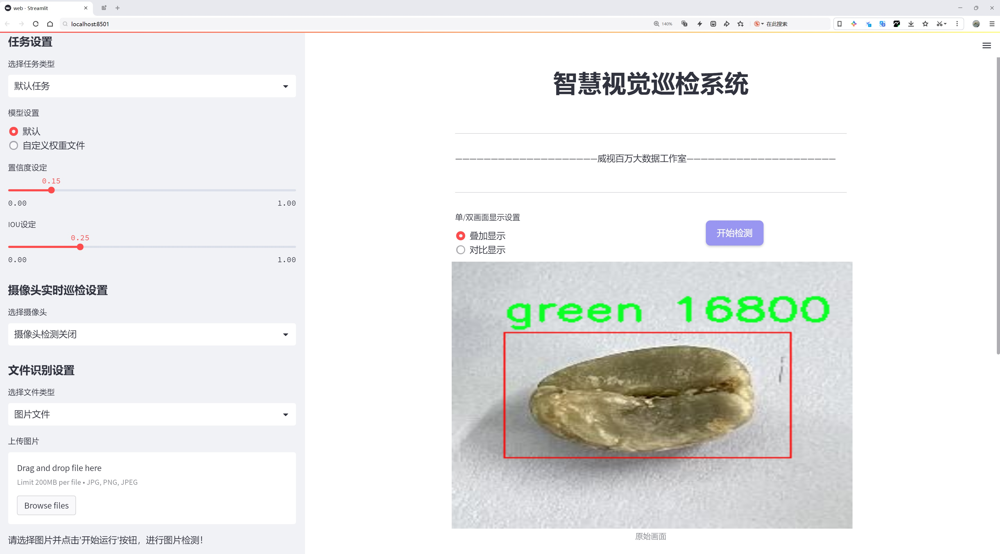
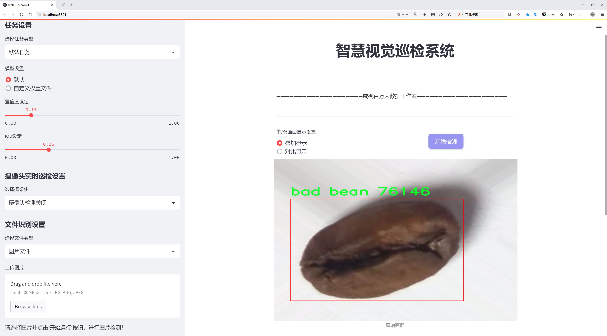
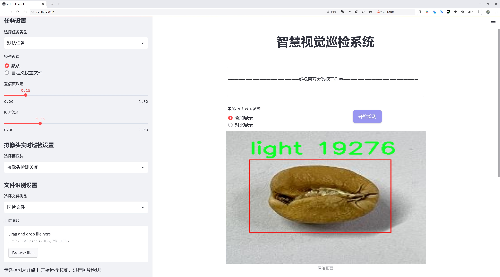
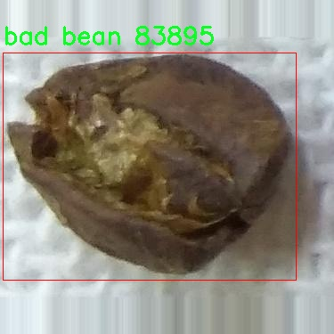
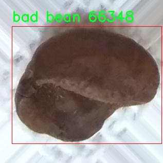
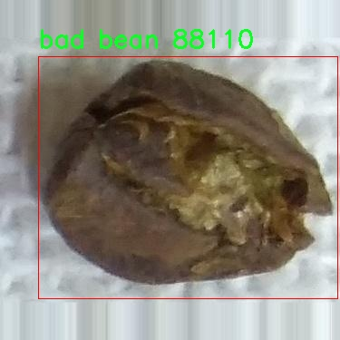
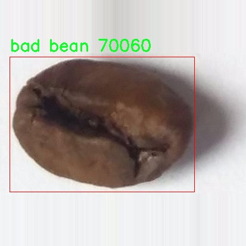
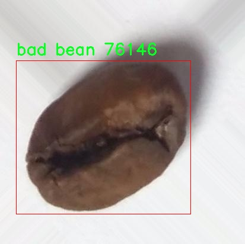

# 咖啡豆等级分类系统源码分享
 # [一条龙教学YOLOV8标注好的数据集一键训练_70+全套改进创新点发刊_Web前端展示]

### 1.研究背景与意义

项目参考[AAAI Association for the Advancement of Artificial Intelligence](https://gitee.com/qunmasj/projects)

项目来源[AACV Association for the Advancement of Computer Vision](https://kdocs.cn/l/cszuIiCKVNis)

研究背景与意义

随着全球咖啡消费的持续增长，咖啡豆的质量和等级分类变得愈发重要。咖啡豆的等级不仅影响其市场价值，还直接关系到消费者的体验和满意度。传统的咖啡豆等级分类主要依赖人工评估，这种方法不仅耗时耗力，而且容易受到主观因素的影响，导致分类结果的不一致性和不准确性。因此，开发一种高效、准确的咖啡豆等级分类系统显得尤为必要。

近年来，深度学习技术的迅猛发展为图像识别和分类任务提供了新的解决方案。YOLO（You Only Look Once）系列模型因其高效的实时检测能力和较高的准确率，广泛应用于物体检测领域。YOLOv8作为该系列的最新版本，进一步提升了模型的性能，尤其在小物体检测和复杂场景下的表现。因此，基于改进YOLOv8的咖啡豆等级分类系统的研究，不仅具有重要的学术价值，也具备广泛的应用前景。

本研究所使用的数据集“CoffeeBeansGradingV2”包含1600张图像，涵盖了五个咖啡豆等级类别：坏豆、深色豆、绿色豆、浅色豆和中等豆。这一数据集的多样性和丰富性为模型的训练和验证提供了良好的基础。通过对这些图像的深入分析，模型能够学习到不同等级咖啡豆的特征，从而实现高效的自动分类。与传统方法相比，基于深度学习的分类系统能够在短时间内处理大量数据，显著提高分类效率和准确性。

此外，随着可持续发展理念的深入人心，消费者对咖啡豆质量的关注也在不断提升。一个高效的咖啡豆等级分类系统不仅能够帮助生产者提高产品质量，还能增强消费者对品牌的信任感，促进咖啡产业的可持续发展。通过引入先进的技术手段，咖啡生产商能够更好地控制生产过程，确保每一批次咖啡豆的质量，从而提升整体市场竞争力。

本研究的意义不仅在于技术层面的创新，更在于其对咖啡产业的深远影响。通过建立一个基于改进YOLOv8的咖啡豆等级分类系统，我们希望能够为咖啡行业提供一种新的解决方案，推动行业的数字化转型。同时，该系统的成功实施也将为其他农产品的质量检测提供借鉴，推动农业智能化的发展。

综上所述，基于改进YOLOv8的咖啡豆等级分类系统的研究，不仅填补了当前咖啡豆分类技术的空白，还为咖啡产业的可持续发展提供了新的思路和方法。通过这一研究，我们期待能够推动咖啡行业的技术进步，提高产品质量，最终实现消费者、生产者和环境的三赢局面。

### 2.图片演示







##### 注意：由于此博客编辑较早，上面“2.图片演示”和“3.视频演示”展示的系统图片或者视频可能为老版本，新版本在老版本的基础上升级如下：（实际效果以升级的新版本为准）

  （1）适配了YOLOV8的“目标检测”模型和“实例分割”模型，通过加载相应的权重（.pt）文件即可自适应加载模型。

  （2）支持“图片识别”、“视频识别”、“摄像头实时识别”三种识别模式。

  （3）支持“图片识别”、“视频识别”、“摄像头实时识别”三种识别结果保存导出，解决手动导出（容易卡顿出现爆内存）存在的问题，识别完自动保存结果并导出到tempDir中。

  （4）支持Web前端系统中的标题、背景图等自定义修改，后面提供修改教程。

  另外本项目提供训练的数据集和训练教程,暂不提供权重文件（best.pt）,需要您按照教程进行训练后实现图片演示和Web前端界面演示的效果。

### 3.视频演示

[3.1 视频演示](https://www.bilibili.com/video/BV1QX2gYgE8J/)

### 4.数据集信息展示

##### 4.1 本项目数据集详细数据（类别数＆类别名）

nc: 5
names: ['bad bean', 'dark', 'green', 'light', 'medium']


##### 4.2 本项目数据集信息介绍

数据集信息展示

在现代农业和食品工业中，咖啡豆的等级分类对于确保产品质量和消费者满意度至关重要。为此，我们开发了一个名为“CoffeeBeansGradingV2”的数据集，旨在为改进YOLOv8模型提供丰富的训练数据，以实现更高效的咖啡豆等级分类系统。该数据集专注于咖啡豆的外观特征，通过对不同等级的咖啡豆进行细致的标注，帮助模型学习并识别各种类型的咖啡豆。

“CoffeeBeansGradingV2”数据集包含五个主要类别，分别是“bad bean”、“dark”、“green”、“light”和“medium”。每个类别代表了咖啡豆在不同生长阶段或处理过程中的特征，具有独特的视觉表现和质量标准。具体而言，“bad bean”类别主要包含那些因病虫害、发霉或其他因素而导致品质下降的咖啡豆，这些豆子通常呈现出不均匀的颜色和形状，且表面可能有明显的瑕疵。“dark”类别则包括那些经过深度烘焙的咖啡豆，其颜色较深，通常带有油光，具有浓烈的香气和风味。

相对而言，“green”类别的咖啡豆则是未经过烘焙的生豆，颜色呈现出鲜明的绿色，通常用于后续的烘焙加工。“light”类别的咖啡豆则是经过轻度烘焙的豆子，颜色较浅，风味清新，适合那些喜欢酸味和果香的消费者。而“medium”类别则代表中度烘焙的咖啡豆，色泽和风味介于深度和轻度烘焙之间，适合广泛的消费者口味。

为了确保数据集的质量和多样性，我们在不同的环境和条件下采集了大量的咖啡豆样本。每个类别的样本数量经过精心设计，以保证模型在训练过程中能够接触到足够的变异性，从而提高其泛化能力。此外，数据集中的每个样本都经过专业的标注，确保其类别标签的准确性。这一过程不仅提升了数据集的可靠性，也为后续的模型训练提供了坚实的基础。

在使用“CoffeeBeansGradingV2”数据集进行YOLOv8模型的训练时，我们采用了多种数据增强技术，以进一步提升模型的鲁棒性。这些技术包括随机裁剪、旋转、亮度调整等，旨在模拟不同的拍摄条件和环境变化，从而使模型能够在实际应用中更好地适应各种情况。通过这种方式，我们希望模型能够在面对真实世界中的咖啡豆时，依然能够保持高效的分类性能。

总之，“CoffeeBeansGradingV2”数据集不仅为咖啡豆等级分类提供了丰富的样本和多样的特征，还为改进YOLOv8模型的训练奠定了坚实的基础。通过对不同等级咖啡豆的细致分类和标注，我们期望能够推动咖啡产业的智能化发展，提高咖啡豆的质量控制水平，最终为消费者提供更优质的咖啡体验。











### 5.全套项目环境部署视频教程（零基础手把手教学）

[5.1 环境部署教程链接（零基础手把手教学）](https://www.ixigua.com/7404473917358506534?logTag=c807d0cbc21c0ef59de5)


[5.2 安装Python虚拟环境创建和依赖库安装视频教程链接（零基础手把手教学）](https://www.ixigua.com/7404474678003106304?logTag=1f1041108cd1f708b01a)

### 6.手把手YOLOV8训练视频教程（零基础小白有手就能学会）

[6.1 手把手YOLOV8训练视频教程（零基础小白有手就能学会）](https://www.ixigua.com/7404477157818401292?logTag=d31a2dfd1983c9668658)


按照上面的训练视频教程链接加载项目提供的数据集，运行train.py即可开始训练



     Epoch   gpu_mem       box       obj       cls    labels  img_size
     1/200     20.8G   0.01576   0.01955  0.007536        22      1280: 100%|██████████| 849/849 [14:42<00:00,  1.04s/it]
               Class     Images     Labels          P          R     mAP@.5 mAP@.5:.95: 100%|██████████| 213/213 [01:14<00:00,  2.87it/s]
                 all       3395      17314      0.994      0.957      0.0957      0.0843

     Epoch   gpu_mem       box       obj       cls    labels  img_size
     2/200     20.8G   0.01578   0.01923  0.007006        22      1280: 100%|██████████| 849/849 [14:44<00:00,  1.04s/it]
               Class     Images     Labels          P          R     mAP@.5 mAP@.5:.95: 100%|██████████| 213/213 [01:12<00:00,  2.95it/s]
                 all       3395      17314      0.996      0.956      0.0957      0.0845

     Epoch   gpu_mem       box       obj       cls    labels  img_size
     3/200     20.8G   0.01561    0.0191  0.006895        27      1280: 100%|██████████| 849/849 [10:56<00:00,  1.29it/s]
               Class     Images     Labels          P          R     mAP@.5 mAP@.5:.95: 100%|███████   | 187/213 [00:52<00:00,  4.04it/s]
                 all       3395      17314      0.996      0.957      0.0957      0.0845


### 7.70+种全套YOLOV8创新点代码加载调参视频教程（一键加载写好的改进模型的配置文件）

[7.1 70+种全套YOLOV8创新点代码加载调参视频教程（一键加载写好的改进模型的配置文件）](https://www.ixigua.com/7404478314661806627?logTag=29066f8288e3f4eea3a4)

### 8.70+种全套YOLOV8创新点原理讲解（非科班也可以轻松写刊发刊，V10版本正在科研待更新）

#### 由于篇幅限制，每个创新点的具体原理讲解就不一一展开，具体见下列网址中的创新点对应子项目的技术原理博客网址【Blog】：


[8.1 70+种全套YOLOV8创新点原理讲解链接](https://gitee.com/qunmasj/good)

#### 部分改进原理讲解(完整的改进原理见上图和技术博客链接)【如果此小节的图加载失败可以通过CSDN或者Github搜索该博客的标题访问原始博客，原始博客图片显示正常】
### YOLOv8简介
在各种目标检测算法中，YOLO系列因其速度和准确度间的优异平衡脱颖而出，能够准确、快速的识别目标，便于部署到各种移动设备中，已经广泛应用于各种领域的目标检测、跟踪和分割。目前最新版本 YOLOv8由原v5的开发团队Ultralytics于2023年1月提出，按规格大小可划分为n、s、m、1和x5个版本，是目前最先进的目标检测算法，有着优异的性能，很适合用于无人机航拍图像目标检测。其网络结构如图所示。

YOLOv8模型包括Input、Backbone、Neck 和Head4部分。其中 Input选用了Mosaic数据增强方法，并且对于不同大小的模型，有部分超参数会进行修改，典型的如大模型会开启 MixUp 和CopyPaste数据增强，能够丰富数据集，提升模型的泛化能力和鲁棒性。Backbone主要用于提取图片中的信息，提供给Neck和Head使用，由多个Conv、C2f模块和尾部的SPPF组成。Conv模块由单个Conv2d、
BatchNorm2d和激活函数构成,用丁是双行在万E5特征图;YOLOv8参考了C3模块的残左绒以心YOLOv7[16l的ELAN思想，设计出了C2f 结构，可以在保证轻量化的同时获得更加丰富的梯度流信息，并根据模型尺度来调整通道数，大幅提升了模型性能;SPPF是空间金字塔池化，能够融合不同尺度的特征。Neck部分主要起特征融合的作用，充分利用了骨干网络提取的特征，采用FPN[17]+PAN[18〕结构，
能够增强多个尺度上的语义表达和定位能力。Head输出端根据前两部分处理得到的特征来获取检测目标的类别和位置信息，做出识别,换以小旦公来和定解耦头结构,将分类和检测头分:9w‘无锅框的位关注侧重点不同的问题，同时也采用了无锚框的目标检测（Anchor-Free)，能够提升检测速度。Loss计算方面采用了正负样本动态分配策略，使用 VFLLoss 作为分类损失，使用DFLLoss+CIOU Loss作为回归损失。

### AutoFocus: Efficient Multi-Scale Conv简介

参考该博客提出了AutoFocus，一种高效的多尺度目标检测算法。相较于以前对整个图像金字塔进行处理，该方法以一种由表及里的姿态，仅处理哪些整体上看来很有可能存在小物体的区域。这个可以通过预测一张类别未知的分割图FocusPixels来得到。为了高效利用FocusPixels，另外一个算法用于产生包含FocusPixels的FocusChips，这样可以减少计算量并处理更更精细的尺度。在不同尺度上FocusChips所得到的检测结果综合时，会出现问题，我们也提供了解决问题的方案。AutoFocus在COCO上的结果有49.7%mAP（50%重叠下68.3%），与多尺度baseline相仿但是快了2.5倍。金字塔中处理的像素数量减少了5倍mAP只下降1%，在与RetinaNet采用相同的ResNet-101结构且速度相同时，高了10%mAP。

人类寻找物体是一个动态的过程，且寻找时间与场景的复杂度是直接相关的。当我们的眼神在不同的点之间漂移时，其他的区域会被我们有意忽视。然而，现在的检测算法是一种静态的推理过程且图像金字塔中的每个像素都受到了一样的对待，这使得过程变得没有效率。现在许多的应用都不强调实时性，而计算上的节省其实可以产生很大收益。

在COCO数据集中，虽然40%的物体都是小物体，但是它们一共只占了全图的0.3%。如果金字塔是3倍关系，则在高分辨率层要进行9倍的运算。XXX 。那么有没有办法在低分辨率下找出可能含有这些物体的区域呢？

以人眼方案类比，我们可以从低分辨率图像开始，找出有可能存在物体的区域再“聚集”到高分辨率。我们的AutoFocus会在一层中计算小物体的分割图FocusPixels，而在每一个FocusPixels上会用一个算法产生下一层所需要关注的chips。在COCO的最大分辨率层上我们可以只处理**20%的像素而性能不下降，如果只处理5%**也只下降1%而已。


图像金字塔与卷积神经网络对CV十分重要。然而卷积神经网络无法做到对尺度不敏感，所以为了不同大小的物体需要依赖图像金字塔。虽然训练已经有了高效的方法，但是其推断时间依然远离实际使用标准。

目标检测加速有很长历史了。常用的有特征近似以减少尺度、级联、特征金字塔，且最后一个最近很多人研究。

AutoFocus为速度与精度之间提供了一个平滑的折衷，指出可以在低分辨率下看出小物体的所在，从而节约计算。FocusPixels的计算较为容易。

先简单介绍一下SNIP，是一种多尺度的训练、推断算法。主要思想是训练针对某个特定scale的检测器而不是scale-invariant检测器。这样训练样本就局限于在某个尺度范围内，以适于这个检测器处理。比如在高分辨率仅处理小物体而高分辨率仅处理大物体，其优势在于训练时不用考虑尺度的变化。

由于训练时物体大小是已知的，我们在图像金字塔中可以忽略大量区域而只处理物体周围的区域。SNIPER说明这样低分辨率的训练与全图训练相比并不会降低性能。同样，在推断过程中如果可以在大分辨率图像上预测可能出现小物体的chip，我们也就不用处理整张高分辨率图片。在训练时，许多物体会被裁剪、扭曲，这可以当作是一种数据扩增，然而当这个情况在推断时出现，则会产生错误，所以我们还需要一个算法来整合不同尺度上的检测结果。

#### AutoFocus框架
如SIFT、SURF等传统分类特征包含两个组件，一个detector和一个descriptor。detector只包含轻量级的操作如DoG、LoG，用于在整张图片上找到感兴趣的区域；descriptor，一般来说计算量比较大，则只需要关注那些咸兴趣的区域。这个级联结构保障了图片处理的效率。

同样，AutoFocus框架也是用于预测感兴趣的区域，并丢弃在下一尺度不可能存在物体的区域，并将裁剪和缩放后的区域传递给下一尺度。AutoFocus由三个部分组成：FocusPixels，FocusChips和focus stacking。

#### FocusPixels
FocusPixels定义在卷积网络特征图的粒度之上（如conv5），如果特征图上某个像素与小物体有重叠则标注为一个FocusPixel。（小物体：面积处于一个网络的输入范围之内）。训练过程中，FocusPixels标注为正，某些与不在面积范围内的物体有重叠的像素标注为无效，其他像素标注为负。AutoFocus的训练目标是使在FocusPixels区域产生较大的激活值。

如果同时多个物体与同一像素重叠，优先给正标注。我们的网络输入是512x512，然后a,b,c取值分别是5,64,90。对于太大或太小的物体，我们认为当前尺度上没有足够人信息进行判断，所以会标定为无效。整个网络结构如下图。训练时加两层带ReLU的卷积(3x3和1x1)以及一个二分类softmax来预测FocusPixels。


#### FocusChip生成
推断过程中，我们标注输出概率大于阈值t的像素（这个参数可以控制加速比），得到一些连通域。对于每一个域，我们做一次膨胀使其包含一些有助于识别的周围信息，膨胀后相连的部分要合并。然后，我们生成一些包含连通域的chips（不同chips可能重叠，如有重叠则合并）。有些chip可能太小缺少必要信息，并使chip的大小变化很大，为了效率我们要求保证一个最小的chip size。算法流程如下：


#### 级联推断过程
我们的过程类似于图片金字塔的推断过程但是在过程中一步步去除不关注的图片区域。我们在最低分辨率上进行检测并生成chips，然后在这些chips再进行检测和生成chips。

#### Focus Stacking
这种级联分类器的一个问题是在chip边缘本来的大物体可能生成一些被剪裁的检测目标。在下一个尺度上，由于剪裁过了，所以会检测到小的、错误的正例False Positive。之前算法中的第二步膨胀其实就是为了保证没有物体会出现在chip的边缘。这样，当我们在局部图片chip的边缘检测到物体时，就可以把这个检测结果丢弃，即使其在SNIP的范围内。

也有一些物体在图片边缘的特殊情况。如果chip和图片共享一条边的话，我们会检查检测结果的其他边是否完全在里面，如果在，则保留它，否则丢弃。

在每一尺度得到有效检测结果后，我们可以将不同尺度上的结果进行整合，将这些结果映射到原图坐标系上。最后，非极大值抑制NMS用于聚集。网络结构如之前的图片所示。


### 9.系统功能展示（检测对象为举例，实际内容以本项目数据集为准）

图9.1.系统支持检测结果表格显示

  图9.2.系统支持置信度和IOU阈值手动调节

  图9.3.系统支持自定义加载权重文件best.pt(需要你通过步骤5中训练获得)

  图9.4.系统支持摄像头实时识别

  图9.5.系统支持图片识别

  图9.6.系统支持视频识别

  图9.7.系统支持识别结果文件自动保存

  图9.8.系统支持Excel导出检测结果数据


### 10.原始YOLOV8算法原理

原始YOLOv8算法原理

YOLOv8算法是目标检测领域中的一项重要进展，作为YOLO系列的最新版本，它在检测精度和速度上均展现出显著的优势。YOLO（You Only Look Once）系列算法以其高效的单阶段检测机制而闻名，YOLOv8则在此基础上进行了多项优化，形成了一个更加精细化和高效的网络结构。YOLOv8的整体架构由输入层、Backbone骨干网络、Neck特征融合网络和Head检测模块四个主要部分构成，每个部分在目标检测的过程中都发挥着不可或缺的作用。

在输入层，YOLOv8首先对输入图像进行预处理，以确保图像符合网络的输入要求。这一过程包括图像的缩放和比例调整，旨在消除因图像尺寸不一致带来的影响。此外，YOLOv8还引入了Mosaic增强技术，这种技术通过将多张图像拼接在一起，生成新的训练样本，从而提高模型的泛化能力。同时，瞄点计算的引入使得模型在处理目标时更加精准，为后续的特征提取和目标检测奠定了基础。

YOLOv8的Backbone部分采用了DarkNet结构，但在具体实现上进行了重要的创新。与前代模型相比，YOLOv8使用了C2f模块替代了C3模块，这一变化旨在增强模型的梯度流动性。C2f模块通过将输入特征图分为两个分支，并在每个分支中应用卷积操作，能够有效地提取多层次的特征信息。这种设计不仅保留了YOLO系列的轻量级特性，还显著提升了特征提取的效率。网络的末尾，SPPF（快速空间金字塔池化）模块进一步对输出特征图进行处理，通过不同内核尺寸的池化操作合并特征图，增强了模型对多尺度特征的处理能力。

在Neck部分，YOLOv8继续采用“双塔结构”，结合了特征金字塔网络（FPN）和路径聚合网络（PAN）。这种结构的设计使得不同尺度的特征图能够有效融合，促进了语义信息和定位信息的转移，从而提升了模型对不同尺寸目标的检测能力。通过这种特征融合机制，YOLOv8能够在复杂场景中更好地识别和定位目标，进一步增强了检测的准确性。

最后，在Head检测模块中，YOLOv8采用了解耦头的结构，将回归分支和预测分支分离。这一设计的优势在于能够加速模型的收敛，提高检测速度和精度。通过并行的卷积分支，YOLOv8能够同时计算目标的类别和位置，从而实现高效的目标检测。

值得注意的是，YOLOv8在检测方式上引入了无锚框（Anchor-Free）的理念。这一创新使得模型不再依赖于预设的Anchor框，而是直接预测目标的中心点及其宽高比例。这种方法不仅减少了Anchor框的数量，还提高了检测的灵活性和准确性，使得YOLOv8在处理各种复杂场景时表现得更加出色。

综上所述，YOLOv8算法通过一系列的结构优化和创新设计，形成了一个高效、准确的目标检测系统。其在特征提取、特征融合和目标检测等多个环节的改进，使得YOLOv8在实际应用中展现出优越的性能，成为目标检测领域的重要工具。无论是在学术研究还是工业应用中，YOLOv8都为实现高效的目标检测提供了新的可能性，推动了相关技术的发展与应用。


### 11.项目核心源码讲解（再也不用担心看不懂代码逻辑）

#### 11.1 code\ultralytics\nn\modules\__init__.py

下面是对给定代码的核心部分进行提炼和详细注释的结果：

```python
# Ultralytics YOLO 🚀, AGPL-3.0 license
"""
Ultralytics模块的导入与定义。

这个模块主要包含了YOLO模型所需的各种网络组件，包括卷积层、注意力机制、变换器等。
"""

# 从不同的子模块中导入核心组件
from .block import (
    C1,  # 一种基本的卷积块
    C2,  # 另一种卷积块
    C3,  # 进一步复杂的卷积块
    Bottleneck,  # 残差网络中的瓶颈结构
    # 其他块的导入...
)

from .conv import (
    Conv,  # 标准卷积层
    DWConv,  # 深度可分离卷积
    GhostConv,  # Ghost卷积，用于减少参数量
    ChannelAttention,  # 通道注意力机制
    SpatialAttention,  # 空间注意力机制
    # 其他卷积相关的导入...
)

from .head import (
    Detect,  # 检测头，用于目标检测
    Classify,  # 分类头，用于图像分类
    # 其他头部的导入...
)

from .transformer import (
    TransformerLayer,  # 变换器层
    MLPBlock,  # 多层感知机块
    # 其他变换器相关的导入...
)

# 定义模块的公开接口
__all__ = (
    "Conv",  # 公开标准卷积层
    "DWConv",  # 公开深度可分离卷积
    "Detect",  # 公开检测头
    "Classify",  # 公开分类头
    "TransformerLayer",  # 公开变换器层
    # 其他核心组件的公开...
)
```

### 代码分析与注释

1. **模块导入**:
   - 代码中通过`from .block`, `from .conv`, `from .head`, `from .transformer`等语句导入了多个子模块的组件。这些组件是构建YOLO模型的基础，分别对应不同的功能模块，如卷积层、注意力机制和变换器等。

2. **核心组件**:
   - `Conv`, `DWConv`, `GhostConv`等是不同类型的卷积层，它们在特征提取中起着关键作用。
   - `Detect`和`Classify`是模型的输出头，分别用于目标检测和图像分类任务。
   - `TransformerLayer`和`MLPBlock`则是实现更复杂的网络结构，尤其是在处理序列数据或图像特征时。

3. **公开接口**:
   - `__all__`变量定义了模块的公开接口，只有在`from module import *`时，列出的组件会被导入。这是为了控制模块的可见性，避免不必要的组件被外部访问。

以上是对给定代码的核心部分的提炼和详细注释，突出了YOLO模型构建中的关键组件及其功能。

这个文件是Ultralytics YOLO（You Only Look Once）项目的一部分，主要用于定义和导入各种神经网络模块。该文件的开头包含了一个简短的文档字符串，介绍了该模块的用途，并提供了一个示例代码，展示如何使用这些模块进行模型的可视化。

在示例代码中，首先导入了所需的库和模块，包括PyTorch和该文件中的模块。接着，创建了一个形状为(1, 128, 40, 40)的张量作为输入数据，并实例化了一个卷积层（`Conv`）。然后，使用`torch.onnx.export`将该卷积层导出为ONNX格式的模型文件，并通过系统命令打开该文件。

接下来，文件通过从其他模块导入各种类和函数，构建了一个神经网络模块的集合。这些模块包括不同类型的卷积层（如`Conv`、`DWConv`、`GhostConv`等）、注意力机制（如`ChannelAttention`、`SpatialAttention`、`CBAM`等）、以及其他网络结构组件（如`Bottleneck`、`SPP`、`TransformerLayer`等）。这些组件可以组合在一起，构建出复杂的神经网络架构。

最后，`__all__`变量定义了该模块的公共接口，列出了所有可以被外部导入的类和函数。这种做法有助于控制模块的可见性，确保用户只接触到设计者希望公开的部分。

总的来说，这个文件为Ultralytics YOLO项目提供了一个结构化的方式来组织和管理神经网络模块，使得用户能够方便地构建和使用不同的网络结构。

#### 11.2 ui.py

```python
import sys
import subprocess

def run_script(script_path):
    """
    使用当前 Python 环境运行指定的脚本。

    Args:
        script_path (str): 要运行的脚本路径

    Returns:
        None
    """
    # 获取当前 Python 解释器的路径
    python_path = sys.executable

    # 构建运行命令，使用 streamlit 运行指定的脚本
    command = f'"{python_path}" -m streamlit run "{script_path}"'

    # 执行命令
    result = subprocess.run(command, shell=True)
    # 检查命令执行结果，如果返回码不为0，则表示执行出错
    if result.returncode != 0:
        print("脚本运行出错。")


# 主程序入口
if __name__ == "__main__":
    # 指定要运行的脚本路径
    script_path = "web.py"  # 这里可以替换为实际的脚本路径

    # 调用函数运行脚本
    run_script(script_path)
```

### 代码注释说明：
1. **导入模块**：
   - `sys`：用于访问与 Python 解释器紧密相关的变量和函数。
   - `subprocess`：用于创建新进程、连接到它们的输入/输出/错误管道，并获得返回码。

2. **`run_script` 函数**：
   - 功能：运行指定路径的 Python 脚本。
   - 参数：`script_path` 是要运行的脚本的路径。
   - 获取当前 Python 解释器的路径，以确保使用相同的环境来运行脚本。
   - 构建命令字符串，使用 `streamlit` 模块运行指定的脚本。
   - 使用 `subprocess.run` 执行命令，并检查返回码以判断脚本是否成功运行。

3. **主程序入口**：
   - 使用 `if __name__ == "__main__":` 确保只有在直接运行该脚本时才会执行以下代码。
   - 指定要运行的脚本路径，并调用 `run_script` 函数执行该脚本。

这个程序文件的主要功能是使用当前的 Python 环境来运行一个指定的脚本，具体来说是运行一个名为 `web.py` 的脚本。程序首先导入了必要的模块，包括 `sys`、`os` 和 `subprocess`，这些模块分别用于获取系统信息、处理文件路径和执行外部命令。

在程序中定义了一个名为 `run_script` 的函数，该函数接受一个参数 `script_path`，这个参数是要运行的脚本的路径。函数内部首先获取当前 Python 解释器的路径，这通过 `sys.executable` 实现。接着，构建一个命令字符串，使用 `streamlit` 模块来运行指定的脚本。这个命令字符串的格式是 `"{python_path}" -m streamlit run "{script_path}"`，其中 `python_path` 是当前 Python 解释器的路径，`script_path` 是传入的脚本路径。

然后，使用 `subprocess.run` 方法来执行这个命令。这个方法会在一个新的 shell 中运行命令，并等待其完成。如果命令执行的返回码不为 0，表示脚本运行出错，程序会打印出“脚本运行出错。”的提示信息。

在文件的最后部分，使用 `if __name__ == "__main__":` 语句来确保只有在直接运行该文件时才会执行下面的代码。在这里，首先调用 `abs_path` 函数来获取 `web.py` 的绝对路径，然后调用 `run_script` 函数来运行这个脚本。

总体来说，这个程序的目的是为了方便地运行一个 Streamlit 应用脚本，并且能够处理运行过程中的错误。

#### 11.3 70+种YOLOv8算法改进源码大全和调试加载训练教程（非必要）\ultralytics\utils\callbacks\hub.py

以下是经过简化和注释的核心代码部分：

```python
# 导入所需的库
import json
from time import time
from ultralytics.hub.utils import HUB_WEB_ROOT, PREFIX, events
from ultralytics.utils import LOGGER, SETTINGS

def on_fit_epoch_end(trainer):
    """在每个训练周期结束时上传训练进度指标。"""
    session = getattr(trainer, 'hub_session', None)  # 获取训练会话
    if session:  # 如果会话存在
        # 收集训练损失和其他指标
        all_plots = {**trainer.label_loss_items(trainer.tloss, prefix='train'), **trainer.metrics}
        # 在第一个周期时添加模型信息
        if trainer.epoch == 0:
            from ultralytics.utils.torch_utils import model_info_for_loggers
            all_plots = {**all_plots, **model_info_for_loggers(trainer)}
        
        # 将当前周期的指标添加到会话的指标队列中
        session.metrics_queue[trainer.epoch] = json.dumps(all_plots)
        
        # 检查是否超过上传频率限制
        if time() - session.timers['metrics'] > session.rate_limits['metrics']:
            session.upload_metrics()  # 上传指标
            session.timers['metrics'] = time()  # 重置计时器
            session.metrics_queue = {}  # 重置指标队列

def on_model_save(trainer):
    """在模型保存时上传检查点，遵循速率限制。"""
    session = getattr(trainer, 'hub_session', None)  # 获取训练会话
    if session:  # 如果会话存在
        is_best = trainer.best_fitness == trainer.fitness  # 判断当前模型是否是最佳模型
        # 检查是否超过上传频率限制
        if time() - session.timers['ckpt'] > session.rate_limits['ckpt']:
            LOGGER.info(f'{PREFIX}Uploading checkpoint {HUB_WEB_ROOT}/models/{session.model_id}')  # 日志记录上传信息
            session.upload_model(trainer.epoch, trainer.last, is_best)  # 上传模型
            session.timers['ckpt'] = time()  # 重置计时器

def on_train_end(trainer):
    """在训练结束时上传最终模型和指标到Ultralytics HUB。"""
    session = getattr(trainer, 'hub_session', None)  # 获取训练会话
    if session:  # 如果会话存在
        LOGGER.info(f'{PREFIX}Syncing final model...')  # 日志记录同步信息
        # 上传最终模型和指标
        session.upload_model(trainer.epoch, trainer.best, map=trainer.metrics.get('metrics/mAP50-95(B)', 0), final=True)
        session.alive = False  # 停止心跳
        LOGGER.info(f'{PREFIX}Done ✅\n'
                    f'{PREFIX}View model at {HUB_WEB_ROOT}/models/{session.model_id} 🚀')  # 日志记录完成信息

# 定义回调函数字典，根据设置决定是否启用
callbacks = {
    'on_fit_epoch_end': on_fit_epoch_end,
    'on_model_save': on_model_save,
    'on_train_end': on_train_end
} if SETTINGS['hub'] is True else {}  # 验证是否启用
```

### 代码说明：
1. **导入模块**：导入了必要的库和工具函数，用于处理模型训练和上传的相关操作。
2. **on_fit_epoch_end**：在每个训练周期结束时，收集并上传训练指标。如果是第一个周期，还会添加模型信息。根据速率限制控制上传频率。
3. **on_model_save**：在模型保存时，检查是否超过上传频率限制，并上传当前模型的检查点。
4. **on_train_end**：在训练结束时，上传最终模型和指标，并停止会话的心跳。
5. **callbacks**：根据设置决定是否启用回调函数，便于在训练过程中执行特定操作。

这个程序文件是一个与Ultralytics YOLO（You Only Look Once）模型训练相关的回调函数模块，主要用于在训练过程中记录和上传模型的相关信息。文件中包含多个回调函数，这些函数在特定的训练阶段被调用，以便进行日志记录、模型上传和其他操作。

首先，文件导入了一些必要的库和模块，包括`json`和`time`，以及Ultralytics库中的一些工具和设置。接下来，定义了一系列回调函数，每个函数都对应训练过程中的一个特定事件。

`on_pretrain_routine_end`函数在预训练过程结束时被调用，主要用于记录信息并启动上传速率限制的计时器。如果训练器对象中存在`hub_session`，则会记录模型的访问链接，并初始化计时器。

`on_fit_epoch_end`函数在每个训练周期结束时被调用，负责上传训练进度的指标。它会收集当前周期的损失和其他指标，并在满足速率限制的条件下上传这些数据。

`on_model_save`函数在模型保存时被调用，主要用于将检查点上传到Ultralytics HUB，并根据速率限制进行控制。如果当前模型的表现是最佳的，它会标记这一点并上传。

`on_train_end`函数在训练结束时被调用，负责上传最终模型和相关指标到Ultralytics HUB，并停止心跳信号的发送，以表示训练的完成。

`on_train_start`、`on_val_start`、`on_predict_start`和`on_export_start`函数分别在训练、验证、预测和导出开始时被调用，主要用于执行与这些事件相关的操作。

最后，所有这些回调函数被组织成一个字典`callbacks`，该字典的键是事件名称，值是对应的回调函数。这个字典的创建是基于设置中的`hub`选项，如果启用了hub功能，则会包含这些回调函数。

整体来看，这个文件的主要目的是为YOLO模型的训练过程提供灵活的回调机制，以便在不同阶段记录和上传模型的状态和性能指标，从而支持模型的监控和管理。

#### 11.4 code\ultralytics\utils\metrics.py

以下是代码中最核心的部分，并附上详细的中文注释：

```python
import numpy as np
import torch

def box_iou(box1, box2, eps=1e-7):
    """
    计算两个边界框的交并比（IoU）。
    
    Args:
        box1 (torch.Tensor): 形状为 (N, 4) 的张量，表示 N 个边界框。
        box2 (torch.Tensor): 形状为 (M, 4) 的张量，表示 M 个边界框。
        eps (float, optional): 避免除零的微小值。默认为 1e-7。

    Returns:
        (torch.Tensor): 形状为 (N, M) 的张量，包含 box1 和 box2 中每对边界框的 IoU 值。
    """
    # 获取边界框的坐标
    (a1, a2), (b1, b2) = box1.unsqueeze(1).chunk(2, 2), box2.unsqueeze(0).chunk(2, 2)
    
    # 计算交集面积
    inter = (torch.min(a2, b2) - torch.max(a1, b1)).clamp_(0).prod(2)

    # 计算 IoU = 交集 / (面积1 + 面积2 - 交集)
    return inter / ((a2 - a1).prod(2) + (b2 - b1).prod(2) - inter + eps)

def bbox_iou(box1, box2, xywh=True, eps=1e-7):
    """
    计算边界框的交并比（IoU）。
    
    Args:
        box1 (torch.Tensor): 形状为 (1, 4) 的张量，表示单个边界框。
        box2 (torch.Tensor): 形状为 (n, 4) 的张量，表示 n 个边界框。
        xywh (bool, optional): 如果为 True，输入框为 (x, y, w, h) 格式；如果为 False，输入框为 (x1, y1, x2, y2) 格式。默认为 True。
        eps (float, optional): 避免除零的微小值。默认为 1e-7。

    Returns:
        (torch.Tensor): IoU 值。
    """
    # 获取边界框的坐标
    if xywh:  # 将 (x, y, w, h) 转换为 (x1, y1, x2, y2)
        (x1, y1, w1, h1), (x2, y2, w2, h2) = box1.chunk(4, -1), box2.chunk(4, -1)
        b1_x1, b1_x2, b1_y1, b1_y2 = x1 - w1 / 2, x1 + w1 / 2, y1 - h1 / 2, y1 + h1 / 2
        b2_x1, b2_x2, b2_y1, b2_y2 = x2 - w2 / 2, x2 + w2 / 2, y2 - h2 / 2, y2 + h2 / 2
    else:  # 直接使用 (x1, y1, x2, y2)
        b1_x1, b1_y1, b1_x2, b1_y2 = box1.chunk(4, -1)
        b2_x1, b2_y1, b2_x2, b2_y2 = box2.chunk(4, -1)

    # 计算交集面积
    inter = (b1_x2.minimum(b2_x2) - b1_x1.maximum(b2_x1)).clamp_(0) * (
        b1_y2.minimum(b2_y2) - b1_y1.maximum(b2_y1)
    ).clamp_(0)

    # 计算联合面积
    union = (b1_x2 - b1_x1) * (b1_y2 - b1_y1 + eps) + (b2_x2 - b2_x1) * (b2_y2 - b2_y1 + eps) - inter + eps

    # 返回 IoU 值
    return inter / union

def compute_ap(recall, precision):
    """
    计算平均精度（AP），给定召回率和精度曲线。
    
    Args:
        recall (list): 召回率曲线。
        precision (list): 精度曲线。

    Returns:
        (float): 平均精度。
        (np.ndarray): 精度包络曲线。
        (np.ndarray): 修改后的召回率曲线。
    """
    # 在开头和结尾添加哨兵值
    mrec = np.concatenate(([0.0], recall, [1.0]))
    mpre = np.concatenate(([1.0], precision, [0.0]))

    # 计算精度包络
    mpre = np.flip(np.maximum.accumulate(np.flip(mpre)))

    # 计算曲线下面积
    x = np.linspace(0, 1, 101)  # 101 点插值
    ap = np.trapz(np.interp(x, mrec, mpre), x)  # 积分

    return ap, mpre, mrec
```

### 代码说明：
1. **box_iou**: 计算两个边界框之间的交并比（IoU），可以用于评估目标检测的准确性。
2. **bbox_iou**: 计算单个边界框与多个边界框之间的 IoU，支持不同的输入格式（xywh 或 xyxy）。
3. **compute_ap**: 计算平均精度（AP），通过给定的召回率和精度曲线来评估模型性能。

这些函数是目标检测模型评估的核心部分，能够帮助我们量化模型的检测效果。

这个程序文件是一个用于计算和更新模型验证指标的模块，主要应用于目标检测和分类任务。文件中定义了多个函数和类，以便于计算不同的指标，例如交并比（IoU）、平均精度（AP）、混淆矩阵等。

首先，文件导入了一些必要的库，包括数学计算库、警告处理库、路径处理库、绘图库（matplotlib）、数值计算库（numpy）和深度学习框架（PyTorch）。接着，定义了一些常量和函数，用于计算边界框之间的交集、并集和IoU等。

`bbox_ioa`函数计算给定两个边界框的交集与第二个框的面积的比值。`box_iou`函数计算两个边界框的IoU，返回一个包含每对框的IoU值的张量。`bbox_iou`函数则支持多种IoU计算方式，包括标准IoU、广义IoU（GIoU）、距离IoU（DIoU）和完全IoU（CIoU）。

`mask_iou`函数用于计算掩码的IoU，适用于分割任务。`kpt_iou`函数计算关键点相似性（OKS），用于评估关键点检测的性能。`probiou`和`batch_probiou`函数计算定向边界框之间的概率IoU。

`ConfusionMatrix`类用于计算和更新混淆矩阵，支持分类和检测任务。它提供了处理分类预测和检测结果的方法，能够计算真阳性、假阳性等指标，并可以绘制混淆矩阵图。

接下来，文件中定义了一些绘图函数，如`plot_pr_curve`和`plot_mc_curve`，用于绘制精确度-召回率曲线和其他指标曲线。`compute_ap`函数计算给定召回率和精确度曲线的平均精度。

`Metric`类用于计算YOLOv8模型的评估指标，包括精确度、召回率和平均精度等。`DetMetrics`和`SegmentMetrics`类分别用于计算检测和分割任务的指标，`PoseMetrics`类则用于计算姿态估计的指标。

最后，`ClassifyMetrics`类用于计算分类任务的指标，包括Top-1和Top-5准确率。`OBBMetrics`类用于计算定向边界框的指标。每个类都提供了更新指标的方法和返回结果的方法，以便于在训练和评估过程中使用。

整体而言，这个文件为目标检测、分割和分类任务提供了全面的指标计算和更新功能，便于模型性能的评估和分析。

#### 11.5 70+种YOLOv8算法改进源码大全和调试加载训练教程（非必要）\ultralytics\trackers\utils\matching.py

以下是经过简化和注释的核心代码部分：

```python
import numpy as np
import scipy
from scipy.spatial.distance import cdist
from ultralytics.utils.metrics import bbox_ioa

try:
    import lap  # 导入线性分配库
    assert lap.__version__  # 确保导入的库是有效的
except (ImportError, AssertionError, AttributeError):
    from ultralytics.utils.checks import check_requirements
    check_requirements('lapx>=0.5.2')  # 检查并安装所需的lap库
    import lap

def linear_assignment(cost_matrix, thresh, use_lap=True):
    """
    使用线性分配算法来匹配成本矩阵中的项。

    参数:
        cost_matrix (np.ndarray): 成本矩阵，包含分配的成本值。
        thresh (float): 认为分配有效的阈值。
        use_lap (bool, optional): 是否使用lap.lapjv。默认为True。

    返回:
        (tuple): 包含匹配索引、未匹配的索引a和未匹配的索引b的元组。
    """
    if cost_matrix.size == 0:
        # 如果成本矩阵为空，返回空匹配和所有未匹配索引
        return np.empty((0, 2), dtype=int), tuple(range(cost_matrix.shape[0])), tuple(range(cost_matrix.shape[1]))

    if use_lap:
        # 使用lap库进行线性分配
        _, x, y = lap.lapjv(cost_matrix, extend_cost=True, cost_limit=thresh)
        matches = [[ix, mx] for ix, mx in enumerate(x) if mx >= 0]  # 生成匹配列表
        unmatched_a = np.where(x < 0)[0]  # 找到未匹配的a索引
        unmatched_b = np.where(y < 0)[0]  # 找到未匹配的b索引
    else:
        # 使用scipy进行线性分配
        x, y = scipy.optimize.linear_sum_assignment(cost_matrix)  # 获取匹配的行和列索引
        matches = np.asarray([[x[i], y[i]] for i in range(len(x)) if cost_matrix[x[i], y[i]] <= thresh])
        if len(matches) == 0:
            unmatched_a = list(np.arange(cost_matrix.shape[0]))  # 所有a索引未匹配
            unmatched_b = list(np.arange(cost_matrix.shape[1]))  # 所有b索引未匹配
        else:
            unmatched_a = list(set(np.arange(cost_matrix.shape[0])) - set(matches[:, 0]))  # 找到未匹配的a索引
            unmatched_b = list(set(np.arange(cost_matrix.shape[1])) - set(matches[:, 1]))  # 找到未匹配的b索引

    return matches, unmatched_a, unmatched_b  # 返回匹配和未匹配的索引

def iou_distance(atracks, btracks):
    """
    基于交并比（IoU）计算轨迹之间的成本。

    参数:
        atracks (list): 轨迹a或边界框的列表。
        btracks (list): 轨迹b或边界框的列表。

    返回:
        (np.ndarray): 基于IoU计算的成本矩阵。
    """
    # 如果输入是边界框，直接使用
    if (len(atracks) > 0 and isinstance(atracks[0], np.ndarray)) \
            or (len(btracks) > 0 and isinstance(btracks[0], np.ndarray)):
        atlbrs = atracks
        btlbrs = btracks
    else:
        # 从轨迹中提取边界框
        atlbrs = [track.tlbr for track in atracks]
        btlbrs = [track.tlbr for track in btracks]

    ious = np.zeros((len(atlbrs), len(btlbrs)), dtype=np.float32)  # 初始化IoU矩阵
    if len(atlbrs) and len(btlbrs):
        # 计算IoU
        ious = bbox_ioa(np.ascontiguousarray(atlbrs, dtype=np.float32),
                        np.ascontiguousarray(btlbrs, dtype=np.float32),
                        iou=True)
    return 1 - ious  # 返回成本矩阵

def embedding_distance(tracks, detections, metric='cosine'):
    """
    基于嵌入计算轨迹和检测之间的距离。

    参数:
        tracks (list): 轨迹列表。
        detections (list): 检测列表。
        metric (str, optional): 距离计算的度量。默认为'cosine'。

    返回:
        (np.ndarray): 基于嵌入计算的成本矩阵。
    """
    cost_matrix = np.zeros((len(tracks), len(detections)), dtype=np.float32)  # 初始化成本矩阵
    if cost_matrix.size == 0:
        return cost_matrix  # 如果成本矩阵为空，直接返回

    det_features = np.asarray([track.curr_feat for track in detections], dtype=np.float32)  # 提取检测特征
    track_features = np.asarray([track.smooth_feat for track in tracks], dtype=np.float32)  # 提取轨迹特征
    cost_matrix = np.maximum(0.0, cdist(track_features, det_features, metric))  # 计算特征之间的距离
    return cost_matrix  # 返回成本矩阵

def fuse_score(cost_matrix, detections):
    """
    将成本矩阵与检测分数融合，生成单一相似度矩阵。

    参数:
        cost_matrix (np.ndarray): 成本矩阵。
        detections (list): 带有分数的检测列表。

    返回:
        (np.ndarray): 融合后的相似度矩阵。
    """
    if cost_matrix.size == 0:
        return cost_matrix  # 如果成本矩阵为空，直接返回

    iou_sim = 1 - cost_matrix  # 将成本矩阵转换为相似度
    det_scores = np.array([det.score for det in detections])  # 提取检测分数
    det_scores = np.expand_dims(det_scores, axis=0).repeat(cost_matrix.shape[0], axis=0)  # 扩展分数以匹配成本矩阵
    fuse_sim = iou_sim * det_scores  # 融合相似度和分数
    return 1 - fuse_sim  # 返回融合后的成本矩阵
```

### 代码注释说明：
1. **导入库**：导入必要的库，包括NumPy和SciPy用于数值计算和距离计算，`lap`用于线性分配。
2. **线性分配函数**：`linear_assignment`函数用于根据成本矩阵进行匹配，返回匹配的索引和未匹配的索引。
3. **IoU距离计算**：`iou_distance`函数计算两个轨迹之间的交并比（IoU），并返回成本矩阵。
4. **嵌入距离计算**：`embedding_distance`函数计算轨迹和检测之间的距离，返回成本矩阵。
5. **融合分数**：`fuse_score`函数将成本矩阵与检测分数融合，生成相似度矩阵。

这个程序文件是用于YOLOv8算法中的目标跟踪模块，主要实现了匹配算法和距离计算的功能。文件中导入了必要的库，包括NumPy和SciPy，用于数值计算和线性分配算法的实现。文件首先尝试导入一个名为`lap`的库，如果未能成功导入，则会检查并安装相应的依赖。

在`linear_assignment`函数中，程序实现了线性分配算法，输入为一个成本矩阵和一个阈值，返回匹配的索引以及未匹配的索引。该函数支持使用`lap`库进行高效的线性分配，或者使用SciPy的线性和分配函数作为备选方案。函数中处理了空成本矩阵的情况，并根据匹配结果返回相应的未匹配索引。

`iou_distance`函数用于计算基于交并比（IoU）的成本矩阵。它接受两个轨迹或边界框的列表作为输入，计算它们之间的IoU值，并返回一个成本矩阵。这里的成本是通过1减去IoU值来计算的，表示匹配的“成本”越低，匹配的可能性越高。

`embedding_distance`函数则是计算轨迹和检测之间的距离，基于特征嵌入（embeddings）。它接受轨迹和检测的列表，并计算它们之间的距离矩阵，使用余弦距离作为默认度量。该函数返回的成本矩阵反映了轨迹与检测之间的相似性。

最后，`fuse_score`函数将成本矩阵与检测得分融合，生成一个单一的相似性矩阵。它首先计算IoU相似性，然后将检测得分扩展到与成本矩阵相同的形状，最后通过相乘的方式融合两者，返回融合后的成本矩阵。

整体来看，这个文件实现了目标跟踪中重要的匹配和距离计算功能，为YOLOv8算法的目标跟踪提供了基础支持。

#### 11.6 train.py

以下是经过简化和注释的核心代码部分：

```python
import random
import numpy as np
import torch.nn as nn
from ultralytics.data import build_dataloader, build_yolo_dataset
from ultralytics.engine.trainer import BaseTrainer
from ultralytics.models import yolo
from ultralytics.nn.tasks import DetectionModel
from ultralytics.utils import LOGGER, RANK
from ultralytics.utils.torch_utils import de_parallel, torch_distributed_zero_first

class DetectionTrainer(BaseTrainer):
    """
    DetectionTrainer类，继承自BaseTrainer，用于基于检测模型的训练。
    """

    def build_dataset(self, img_path, mode="train", batch=None):
        """
        构建YOLO数据集。

        参数:
            img_path (str): 包含图像的文件夹路径。
            mode (str): 模式，可以是'train'或'val'，用户可以为每种模式自定义不同的增强。
            batch (int, optional): 批次大小，适用于'rect'模式。默认为None。
        """
        gs = max(int(de_parallel(self.model).stride.max() if self.model else 0), 32)  # 获取模型的最大步幅
        return build_yolo_dataset(self.args, img_path, batch, self.data, mode=mode, rect=mode == "val", stride=gs)

    def get_dataloader(self, dataset_path, batch_size=16, rank=0, mode="train"):
        """构造并返回数据加载器。"""
        assert mode in ["train", "val"]  # 确保模式有效
        with torch_distributed_zero_first(rank):  # 在分布式训练中，确保数据集只初始化一次
            dataset = self.build_dataset(dataset_path, mode, batch_size)  # 构建数据集
        shuffle = mode == "train"  # 训练模式下打乱数据
        workers = self.args.workers if mode == "train" else self.args.workers * 2  # 根据模式设置工作线程数
        return build_dataloader(dataset, batch_size, workers, shuffle, rank)  # 返回数据加载器

    def preprocess_batch(self, batch):
        """对图像批次进行预处理，包括缩放和转换为浮点数。"""
        batch["img"] = batch["img"].to(self.device, non_blocking=True).float() / 255  # 将图像转换为浮点数并归一化
        if self.args.multi_scale:  # 如果启用多尺度
            imgs = batch["img"]
            sz = (
                random.randrange(self.args.imgsz * 0.5, self.args.imgsz * 1.5 + self.stride)
                // self.stride
                * self.stride
            )  # 随机选择图像大小
            sf = sz / max(imgs.shape[2:])  # 计算缩放因子
            if sf != 1:  # 如果需要缩放
                ns = [
                    math.ceil(x * sf / self.stride) * self.stride for x in imgs.shape[2:]
                ]  # 计算新的形状
                imgs = nn.functional.interpolate(imgs, size=ns, mode="bilinear", align_corners=False)  # 进行插值缩放
            batch["img"] = imgs  # 更新批次图像
        return batch

    def get_model(self, cfg=None, weights=None, verbose=True):
        """返回YOLO检测模型。"""
        model = DetectionModel(cfg, nc=self.data["nc"], verbose=verbose and RANK == -1)  # 创建检测模型
        if weights:
            model.load(weights)  # 加载权重
        return model

    def plot_training_samples(self, batch, ni):
        """绘制带有注释的训练样本。"""
        plot_images(
            images=batch["img"],
            batch_idx=batch["batch_idx"],
            cls=batch["cls"].squeeze(-1),
            bboxes=batch["bboxes"],
            paths=batch["im_file"],
            fname=self.save_dir / f"train_batch{ni}.jpg",
            on_plot=self.on_plot,
        )

    def plot_metrics(self):
        """从CSV文件绘制指标。"""
        plot_results(file=self.csv, on_plot=self.on_plot)  # 保存结果图
```

### 代码说明：
1. **DetectionTrainer类**：该类用于训练YOLO检测模型，继承自`BaseTrainer`，提供了构建数据集、获取数据加载器、预处理批次、获取模型等功能。
2. **build_dataset方法**：根据给定的图像路径和模式构建YOLO数据集，支持训练和验证模式。
3. **get_dataloader方法**：构造数据加载器，确保在分布式训练中只初始化一次数据集。
4. **preprocess_batch方法**：对输入的图像批次进行预处理，包括归一化和多尺度调整。
5. **get_model方法**：创建并返回YOLO检测模型，支持加载预训练权重。
6. **plot_training_samples和plot_metrics方法**：用于可视化训练样本和训练过程中的指标。

这个程序文件 `train.py` 是一个用于训练目标检测模型的脚本，主要基于 YOLO（You Only Look Once）模型。它扩展了一个基础训练类 `BaseTrainer`，提供了针对目标检测的训练功能。

首先，文件导入了一些必要的库和模块，包括数学运算、随机数生成、深度学习框架 PyTorch 的相关模块，以及 Ultralytics 提供的用于数据处理、模型构建和训练的工具。

在 `DetectionTrainer` 类中，定义了多个方法来实现数据集的构建、数据加载、批处理预处理、模型属性设置、模型获取、验证器获取、损失项标签化、训练进度字符串格式化、训练样本绘图、指标绘图和训练标签绘图等功能。

`build_dataset` 方法用于构建 YOLO 数据集，接受图像路径、模式（训练或验证）和批次大小作为参数。它会根据模型的步幅（stride）来确定数据集的构建方式。

`get_dataloader` 方法则负责创建和返回数据加载器，确保在分布式训练时只初始化一次数据集。它会根据模式选择是否打乱数据，并设置工作线程的数量。

`preprocess_batch` 方法用于对图像批次进行预处理，包括缩放和转换为浮点数格式。它还支持多尺度训练，通过随机选择图像大小来增强模型的鲁棒性。

`set_model_attributes` 方法将数据集的类数和类名等信息附加到模型上，以便模型能够正确识别和处理不同的类别。

`get_model` 方法用于返回一个 YOLO 检测模型，可以选择加载预训练权重。

`get_validator` 方法返回一个用于模型验证的验证器，能够计算损失并进行评估。

`label_loss_items` 方法返回一个包含训练损失项的字典，方便后续的监控和记录。

`progress_string` 方法生成一个格式化的字符串，用于显示训练进度，包括当前的轮次、GPU 内存使用情况、损失值、实例数量和图像大小等信息。

`plot_training_samples` 方法用于绘制训练样本及其标注，便于可视化训练过程中的数据。

`plot_metrics` 和 `plot_training_labels` 方法则用于绘制训练过程中的指标和标签，帮助用户更好地理解模型的表现和训练情况。

总体而言，这个文件实现了 YOLO 模型的训练流程，涵盖了数据处理、模型构建、训练监控和结果可视化等多个方面，为用户提供了一个完整的训练框架。

### 12.系统整体结构（节选）

### 整体功能和构架概括

该项目是一个基于YOLOv8的目标检测框架，提供了训练、验证和推理的完整流程。其核心功能包括模型的构建、数据处理、训练过程的监控、性能评估以及结果的可视化。项目通过模块化的设计，将不同的功能分散到多个文件中，使得代码结构清晰，易于维护和扩展。

- **模型模块**：定义了YOLOv8的网络结构，包括不同的层和模块。
- **训练模块**：实现了训练过程的控制，包括数据加载、模型训练、损失计算和进度监控。
- **评估模块**：提供了计算各种性能指标的功能，如精确度、召回率和平均精度等。
- **回调模块**：在训练过程中实现特定事件的处理，如模型保存、上传和日志记录。
- **工具模块**：包含一些辅助功能，如匹配算法和距离计算，支持目标跟踪。

### 文件功能整理表

| 文件路径                                                                                         | 功能描述                                                     |
|--------------------------------------------------------------------------------------------------|------------------------------------------------------------|
| `code\ultralytics\nn\modules\__init__.py`                                                      | 定义和导入YOLOv8模型的神经网络模块。                       |
| `ui.py`                                                                                         | 运行指定的Streamlit应用脚本。                              |
| `70+种YOLOv8算法改进源码大全和调试加载训练教程（非必要）\ultralytics\utils\callbacks\hub.py` | 实现训练过程中的回调函数，用于记录和上传模型信息。        |
| `code\ultralytics\utils\metrics.py`                                                            | 计算和更新模型的验证指标，如IoU、AP、混淆矩阵等。         |
| `70+种YOLOv8算法改进源码大全和调试加载训练教程（非必要）\ultralytics\trackers\utils\matching.py` | 实现目标跟踪中的匹配算法和距离计算功能。                   |
| `train.py`                                                                                      | 负责YOLOv8模型的训练流程，包括数据加载、模型训练和监控。  |
| `code\ultralytics\nn\modules\head.py`                                                          | 定义YOLOv8模型的头部结构，处理输出层的设计。               |
| `70+种YOLOv8算法改进源码大全和调试加载训练教程（非必要）\ultralytics\models\fastsam\val.py`   | 实现FastSAM模型的验证功能。                                |
| `70+种YOLOv8算法改进源码大全和调试加载训练教程（非必要）\ultralytics\nn\modules\block.py`     | 定义YOLOv8模型中的基本模块，如卷积块和激活函数。           |
| `70+种YOLOv8算法改进源码大全和调试加载训练教程（非必要）\ultralytics\utils\callbacks\base.py` | 提供基础回调类，供其他回调类继承和扩展。                   |
| `code\ultralytics\models\yolo\segment\__init__.py`                                            | 定义YOLOv8分割模型的初始化和相关功能。                      |
| `code\ultralytics\utils\callbacks\wb.py`                                                       | 实现与Weights & Biases集成的回调功能，用于监控训练过程。   |
| `code\ultralytics\engine\validator.py`                                                         | 实现模型验证的功能，计算损失和评估指标。                   |

这个表格提供了每个文件的主要功能概述，帮助理解整个项目的结构和功能分布。

注意：由于此博客编辑较早，上面“11.项目核心源码讲解（再也不用担心看不懂代码逻辑）”中部分代码可能会优化升级，仅供参考学习，完整“训练源码”、“Web前端界面”和“70+种创新点源码”以“13.完整训练+Web前端界面+70+种创新点源码、数据集获取”的内容为准。

### 13.完整训练+Web前端界面+70+种创新点源码、数据集获取


# [下载链接：https://mbd.pub/o/bread/ZpyYmZtv](https://mbd.pub/o/bread/ZpyYmZtv)